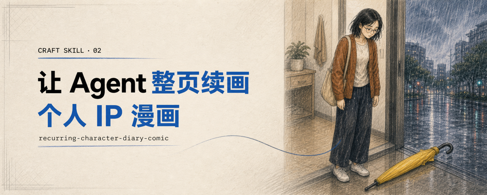

# Craft Skills

[简体中文](README.md) | [English](README.en.md)

Research-backed, eval-driven skills for AI agents.

Craft Skills turns transferable craft knowledge into focused workflows with
explicit trigger boundaries, exit conditions, original examples, and forward
tests. It is not a video-summary archive, prompt dump, or style-cloning
collection.

Created and curated by [Fini Yang](https://github.com/finiking). Maintained by
[ZSeven](https://github.com/ZSeven-W).

## Skills

| Skill | Purpose | Status |
|---|---|---|
| [`logo-semantic-fusion`](skills/logo-semantic-fusion/README.en.md) | Design and evaluate marks in which multiple meanings genuinely share geometry. [Read the guide](docs/logo-semantic-fusion.md) · [Agent workflow](skills/logo-semantic-fusion/SKILL.md) | v0.1 experimental |
| [`recurring-character-diary-comic`](skills/recurring-character-diary-comic/README.en.md) | Create, audit, and repair 4–8 panel page-native diary comics around an authorized recurring character; compare three page structures, lock directional evidence and exact dialogue, and review the final hash at original size and 25%. [Read the guide](docs/recurring-character-diary-comic.md) · [Agent workflow](skills/recurring-character-diary-comic/SKILL.md) | v0.2 experimental |
| [`native-transparent-imagegen`](skills/native-transparent-imagegen/README.en.md) | Generate native-transparent PNG/WebP assets and verify untouched alpha, fine edges, and evidence. RGB checkerboards fail, and background removal cannot manufacture success. [Read the guide and Tuanzi/Hutao case](docs/native-transparent-imagegen.md) · [Agent workflow](skills/native-transparent-imagegen/SKILL.md) | v0.1 experimental |
| [`single-path-process-diorama`](skills/single-path-process-diorama/README.en.md) | Turn a 3–5-step process into one complete miniature world, preserving sequence and meaningful state changes. [Guide](docs/single-path-process-diorama.md) · [Agent workflow](skills/single-path-process-diorama/SKILL.md) | v0.1.1-rc.1 experimental candidate |

## Turn a process into a miniature world

[](skills/single-path-process-diorama/README.en.md)

One process becomes one integrated scene, not a collage of separately generated stages.
Materials, actions, and spatial rhythm follow the subject rather than a fixed track template.

- [Coffee, four steps](skills/single-path-process-diorama/assets/examples/coffee.png): green beans to roasted beans, grounds, and a served drink.
- [Code delivery, five steps](skills/single-path-process-diorama/assets/examples/code.png): marked modules connect submission, testing, review, packaging, and deployment.
- [Parcel delivery, three steps](skills/single-path-process-diorama/assets/examples/parcel.png): packing, transport, and handoff in one neighborhood.

```text
Use $single-path-process-diorama to turn “topic → draft → edit → publish” into
one 3:4 paper-and-wood miniature newsroom. Preserve manuscript identity, avoid panels,
and inspect the final sequence, actions, and lettering.
```

Requires image generation and visual inspection; only built-in imagegen was tested.
Not an engineering drawing or complete branching flowchart. Three paired image cases yielded
two wins and a tie, not a stable success rate. The cover is not a fourth validated case.

## Native transparency, not a drawn checkerboard

`native-transparent-imagegen` is not a magic “transparent background” prompt. It proves whether
the delivered file actually contains model-native alpha:

- generate new assets one at a time and preserve the model's original bytes;
- require encoded alpha, fully transparent pixels, and transparent corners when applicable;
- fail RGB checkerboards and retry only within a fixed limit;
- forbid matting, chroma key, segmentation, or locally written alpha from manufacturing success;
- inspect fur, glass, smoke, and translucent haze over contrasting viewer backgrounds after the
  metadata gate passes.

The [first-version Tuanzi and Hutao fur case](examples/native-transparent-imagegen-tuanzi-hutao.md)
used a character action sheet supplied directly by the rights holder as a held-out local identity
reference. One of three native generations returned RGBA; two returned RGB files containing drawn
checkerboards. The RGBA attempt still failed the hero-case visual gate because of broad low-alpha
haze. The public claim is therefore not “this prompt always works,” but: **if it cannot be verified,
it is not ready to use.**

```text
Use $native-transparent-imagegen to generate a transparent PNG with model-native alpha.
Validate the untouched original one asset at a time; report failure instead of removing a background.
```

[](docs/logo-semantic-fusion.md)

[](docs/recurring-character-diary-comic.md)

“Experimental” means the workflow has structured tests and original examples;
it does not imply production readiness, trademark clearance, or professional
approval.

## Install

Clone the collection, then copy only the skill you want:

```sh
git clone https://github.com/ZSeven-W/craft-skills.git
mkdir -p "${CODEX_HOME:-$HOME/.codex}/skills"
cp -R craft-skills/skills/logo-semantic-fusion \
  "${CODEX_HOME:-$HOME/.codex}/skills/"

# Or install the recurring-character comic skill:
cp -R craft-skills/skills/recurring-character-diary-comic \
  "${CODEX_HOME:-$HOME/.codex}/skills/"

# Or install the native-transparency image skill:
cp -R craft-skills/skills/native-transparent-imagegen \
  "${CODEX_HOME:-$HOME/.codex}/skills/"
```

For the diorama candidate, clone its actual branch and install into a previously absent destination:

```sh
git clone --branch agent/add-process-diorama https://github.com/ZSeven-W/craft-skills.git craft-skills-diorama
mkdir -p "${CODEX_HOME:-$HOME/.codex}/skills"
cp -R craft-skills-diorama/skills/single-path-process-diorama "${CODEX_HOME:-$HOME/.codex}/skills/"
```

Back up an existing installation to avoid nested copies or overwritten customizations. After merging,
the default branch can be used. These instructions do not install anything automatically.
Restart or reload the agent session if the skill is not discovered immediately.

## Release standard

Every published skill must:

- solve one narrow, reusable user goal;
- define both trigger and non-trigger boundaries;
- include applicability, exit, and evidence rules;
- use original examples and appropriately licensed assets;
- cover normal, incomplete, non-trigger, and edge cases in its evals;
- demonstrate improvement on unseen tasks, not only bundled examples;
- distinguish inspected artifacts from prompts or intended outputs;
- pass the repository's deterministic release checks;
- state material limitations and avoid unsupported professional or legal claims.

## Sources and media

Public educational material may inform a skill's methodology. Influential
sources are linked in that skill's provenance notes or third-party notice.
Attribution records research context and does not imply endorsement.

This repository does not include downloaded videos, audio, covers, screenshots,
transcripts, platform metadata, or third-party brand assets. Public examples
must be original or explicitly licensed. Research archives and acquisition
tools remain outside this repository and its release history.

## Contributing

Bug fixes, clearer instructions, additional evals, and original test cases are
welcome. Read [CONTRIBUTING.md](CONTRIBUTING.md) before proposing a new skill.

Do not submit automated source conversions, near-verbatim summaries, creator
style clones, scraped media, generic prompt collections, or outputs presented
as verified without artifact evidence.

## Validate

Use Python 3.10 or newer. Install the validator dependencies, then run the
deterministic release check from the repository root:

```sh
python3 -m pip install -r \
  evals/recurring-character-diary-comic/requirements.txt
python3 scripts/check_release.py
```

The root check invokes any per-skill eval validator shipped by the collection,
in addition to checking package structure, links, metadata, media, and release
hygiene.

## License

Original repository material is licensed under the
[Apache License 2.0](LICENSE). Linked or third-party material retains its
respective rights; see [THIRD_PARTY_NOTICES.md](THIRD_PARTY_NOTICES.md).
