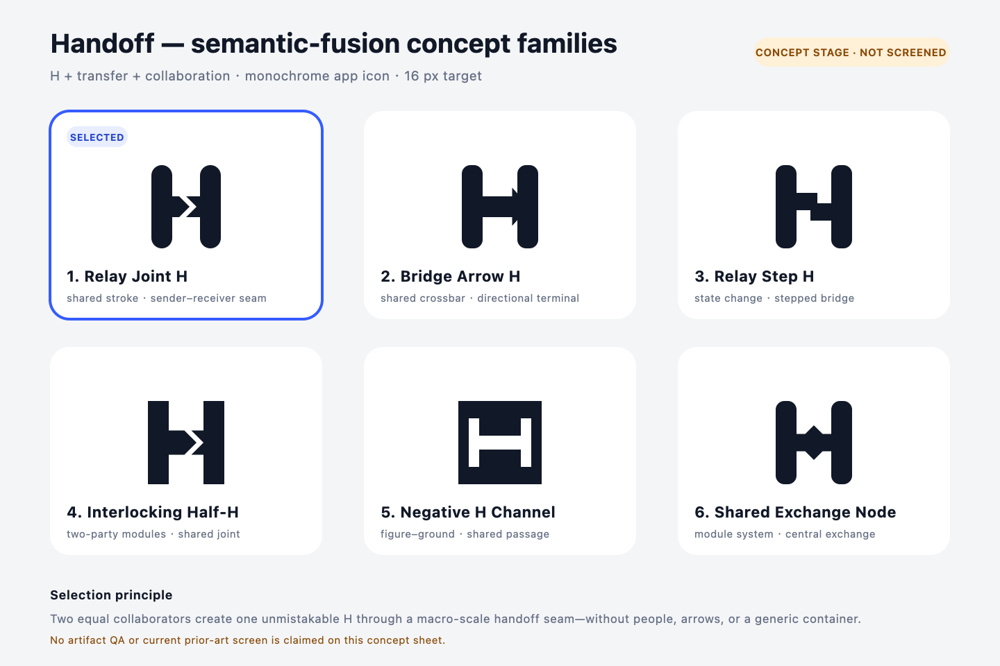
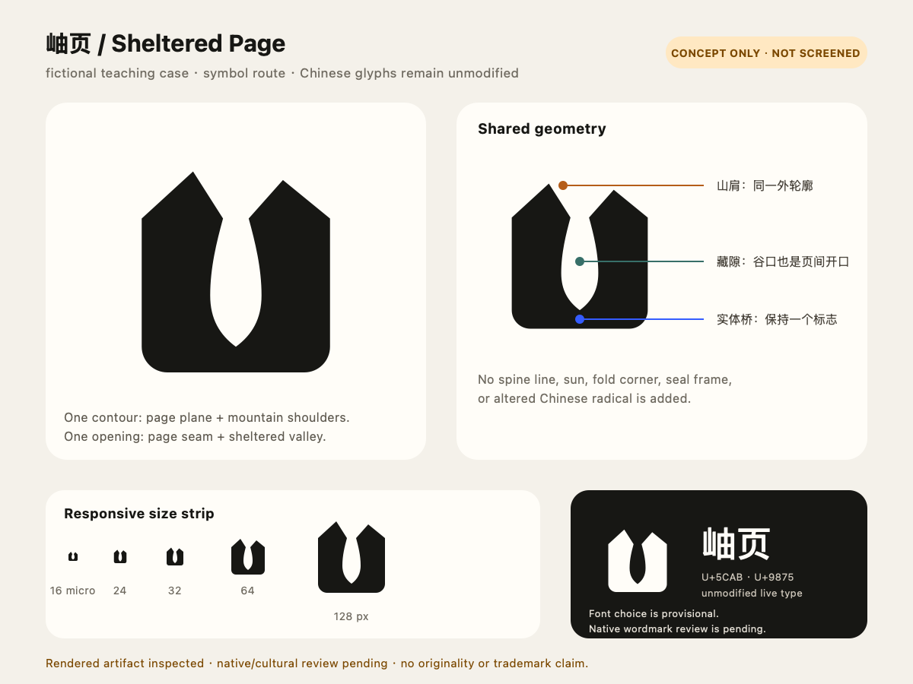
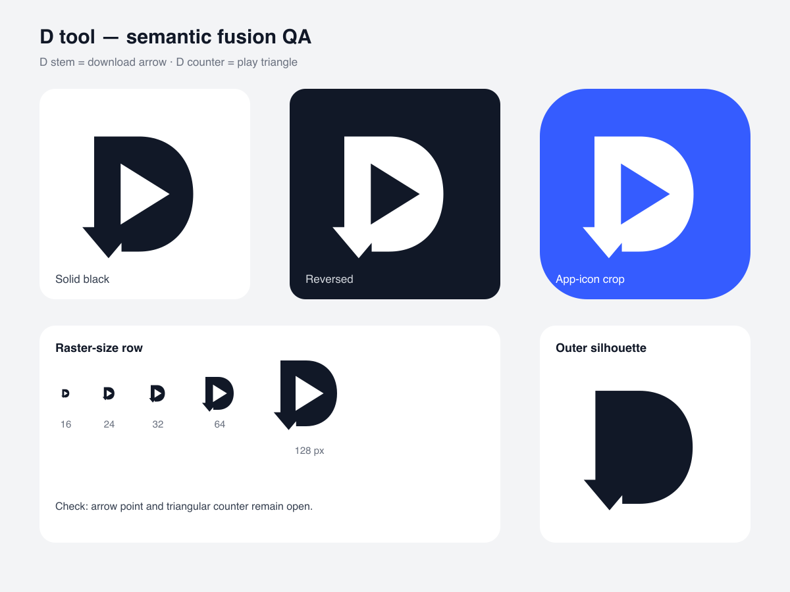

# Logo Semantic Fusion Skill

[Back to the Craft Skills collection](../README.md)

An experimental Codex skill for logo ideation and critique when two or more
brand meanings need to share the same contour, stroke, void, glyph structure,
or modular system.

**Status: v0.1 experimental.** This is a structured concept-development and
review workflow. It is not a replacement for brand strategy, a professional
identity designer, native-script review, production artwork engineering,
audience testing, or trademark counsel.

## When to use it

Use this skill when semantic fusion is the actual design problem: for example,
an initial and a product action must become one mark, or a critique needs to
decide whether two readings truly share geometry.

Do not use it merely because a task mentions a logo. The skill begins with an
applicability gate and may recommend a wordmark, a single symbol, an abstract
system, or a broader identity process when fusion would make the result forced
or generic.

The skill supports four modes:

| Mode | Intended result |
|---|---|
| `design` / `redesign` | Build and select fusion concept families, then render and inspect an artifact when the available tools support it. |
| `critique` | Evaluate a supplied mark and report defects or risks without silently turning the request into a redesign. |
| `compare` | Compare supplied directions against the same brief, fusion test, and evidence standard. |
| `prompt-only` | Produce a production prompt and future acceptance tests. It must state that no artifact was inspected and must not claim visual QA or production readiness. |

## Install

Clone or download this repository, then copy the skill folder into the Codex
personal skill directory:

```sh
mkdir -p "${CODEX_HOME:-$HOME/.codex}/skills"
cp -R skills/logo-semantic-fusion "${CODEX_HOME:-$HOME/.codex}/skills/"
```

For development, link the checkout instead of copying it (the destination must
not already exist):

```sh
mkdir -p "${CODEX_HOME:-$HOME/.codex}/skills"
ln -s "$PWD/skills/logo-semantic-fusion" \
  "${CODEX_HOME:-$HOME/.codex}/skills/logo-semantic-fusion"
```

If another skill-compatible agent uses a different discovery directory, place
`skills/logo-semantic-fusion` in that agent's documented skill path. Keep the
installed folder name `logo-semantic-fusion` so it matches the skill metadata.

Restart or reload the agent session after installation if the skill does not
appear immediately.

## Invoke

Name the skill and the desired mode explicitly when you need predictable
routing. Examples:

```text
Use $logo-semantic-fusion in design mode for a monochrome app icon that fuses
the letter N with a secure handoff. It must survive at 16 px.
```

```text
Use $logo-semantic-fusion in critique mode. Inspect the attached mark and tell
me whether the leaf and speech-bubble meanings are genuinely fused. Do not
redesign it.
```

```text
Use $logo-semantic-fusion in compare mode to rank these three SVG directions
for brand fit, fusion quality, distinctiveness, and small-size legibility.
```

```text
使用 $logo-semantic-fusion 的 prompt-only 模式，为「山行」做一个“山势 +
路径”共形的中文品牌标志生成提示词。不要声称已经完成视觉验收。
```

Useful brief inputs include the brand name and pronunciation, audience,
category, promise, desired personality, target surfaces and sizes, required
scripts, must-keep or forbidden motifs, and color or accessibility constraints.

## What the workflow enforces

- An applicability decision before concept generation.
- A compact semantic inventory and no more than three primary signals.
- Multiple concept families that use genuinely different structural methods.
- A fusion test: at least one contour, stroke, void, or module must perform two
  semantic jobs; movable, intact icons still count as collage.
- Originality and category-risk checks before polishing. These checks are
  screening tools, not legal clearance.
- Artifact-based visual QA at relevant sizes and color conditions. A prompt,
  source file, or successful render command is not visual evidence by itself.
- Honest exits: semantic fusion is allowed to be the wrong strategy.

## Visual examples

### Hero case: Handoff

[](../examples/handoff-hero.md)

The selected `Relay Joint H` makes two collaborator-owned stems share a
sender–receiver crossbar. The case includes editable SVG sources, a responsive
micro mark, and a rendered QA board. It remains concept-stage and does not claim
current-market distinctiveness.

| Script-safety case | Regression fixture |
|---|---|
| [](../examples/chinese-brand-native-review.md) | [](../examples/d-tool-regression.md) |
| The symbol fuses page and mountain geometry while leaving the Chinese wordmark unmodified. | The D tool fixture demonstrates artifact-based reduction testing; it is not a hero identity. |

## Boundaries and known limits

### Trademark and originality

The workflow can identify obvious category clichés and request competitor
research, but it does not perform a comprehensive trademark search, freedom-to-
operate analysis, or legal clearance. Before adopting a mark, search relevant
classes and territories and consult a qualified professional where appropriate.

### Non-native scripts and culture

Do not treat generated Chinese characters, radicals, Arabic joining, Indic
shaping, or any unfamiliar writing system as accepted merely because the
geometry looks plausible. A native reader or script specialist must verify
legibility, pronunciation, connotation, stroke logic, and cultural fit. If that
review is unavailable, label the result provisional and avoid production use.

### Production identity work

A passing concept review does not create a complete identity system. Responsive
logo variants, typography, spacing rules, color specifications, accessibility,
print behavior, app-store masks, signage, file preparation, and governance still
need purpose-specific design and testing.

### Evidence discipline

Only claim visual QA for an artifact that was actually rendered and inspected.
In `prompt-only` mode, or when an attachment cannot be opened, report the
missing evidence instead of inferring success from instructions.

## Package layout

```text
.
├── skills/logo-semantic-fusion/
│   ├── SKILL.md                 # Agent workflow and routing
│   ├── agents/openai.yaml       # Skill-list metadata
│   └── references/              # Methods, review gates, and provenance notes
├── assets/examples/
│   ├── handoff/                 # Original hero mark, sheets, and renders
│   ├── xiuyue/                  # Original script-safety symbol and case board
│   └── d-tool/                  # Hash-pinned visual regression fixture
├── examples/
│   ├── handoff-hero.md          # Visual concept-to-QA walkthrough
│   ├── english-app-icon.md      # New-design walkthrough
│   ├── chinese-brand-native-review.md
│   ├── critique-only.md         # No unsolicited redesign
│   └── d-tool-regression.md     # Regression case, not a hero identity
├── evals/logo-semantic-fusion/
│   └── cases.yaml               # Ten behavioral and boundary test cases
├── scripts/check_release.py     # Deterministic release-hygiene checks
├── THIRD_PARTY_NOTICES.md
└── LICENSE
```

The files under `examples/` and `assets/examples/` are fictional demonstrations,
not approved brand assets or trademark clearance.

## Validate

Run the bundled release check from the repository root:

```sh
python3 scripts/check_release.py
```

It checks the required package structure, skill metadata, Markdown links,
common secret patterns, machine-specific paths, agent metadata, and the exact
hashes, sizes, dimensions, and safe SVG structure of approved visual assets.
Unlisted media still fails the release. These checks do not prove design
quality. Review and run the cases in
`evals/logo-semantic-fusion/cases.yaml` against the target agent
when changing routing, mode behavior, or acceptance gates.

For a visual forward test, use a new brief that is not represented in the
examples, inspect the actual output at the requested sizes, and record both
failure modes and any decision to exit semantic fusion.

## Source and media policy

The methodology was informed in part by public educational videos from
BIGFISH. Attribution and source links are listed in
[THIRD_PARTY_NOTICES.md](../THIRD_PARTY_NOTICES.md).

**No downloaded videos, audio, covers, screenshots, transcripts, platform
metadata, or third-party logo assets are included in this repository.** The
visuals under `assets/examples/` are original project-created teaching assets;
their public paths and hashes are pinned by the release checker. Do not add a
local source-media archive to forks or release bundles. The `.gitignore` blocks
common raw-media locations and formats as an additional guardrail.

## License

Original project material is available under the
[Apache License 2.0](../LICENSE). That license does not grant rights to third-party
content, names, trademarks, linked material, or platform branding; see
[THIRD_PARTY_NOTICES.md](../THIRD_PARTY_NOTICES.md).
