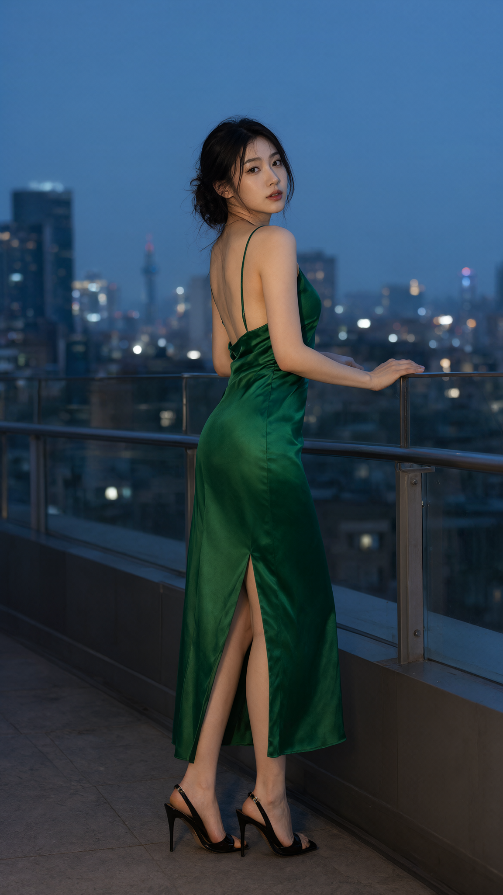

# Qwen-Image 生图与编辑：从输入到验收

`qwen-image-gen` 适合已经部署模型、却经常得到偏离要求的图片的用户。它整理输入和验收流程；不承诺每个复杂姿态都能成功。

## 安装

从 Craft Skills 取得 `skills/qwen-image-gen`，将整个目录放入 Agent 的技能目录。Codex 默认目录是 `~/.codex/skills/`。已有同名目录时先备份，避免嵌套复制。重新加载 Agent 后，以 `$qwen-image-gen` 调用。

## 三种常用任务

1. **文生图**：明确主体、数量、动作、文字与构图。真正要印出的文案与执行说明分开。
2. **局部编辑**：先写修改目标，再锁定未修改内容。换耳环颜色不需要重写整个人物。
3. **参考主体创作**：明确哪张图负责人物身份，再描述新动作。转成正面时，允许肩部、手臂和服装褶皱一起变化。

同人物系列每次使用一张验收过的身份参考；每条提示词只有一个动作。缺少图片时，先给标明条件的草案，不声称已看图。

## 尺寸和执行

比例是单独的参数决策。下游不识别 `wh_ratio` 时，应映射为它接受的宽高，而不是把整段 JSON 当成提示词。实际图片尺寸必须从输出核对。

只写提示词无需 GPU。已经授权生成时，使用用户指定的现有接口，跟踪任务并检查原图。本 Skill 不包含服务器、账户信息或自动下载权重的逻辑。

适配器示例（从仓库根目录执行）：

```sh
python3 -B skills/qwen-image-gen/scripts/prepare_workbench_request.py rewrite.json --quality high --seed 0 --out request.json
python3 -B -m unittest discover -s skills/qwen-image-gen/tests -v
```

对这个适配器而言，9:16 的 high 档是1152×2048。编辑约1MP是该工作流的限制，不代表官方模型限制；不支持的多图、像素或扩图要求会明确报错。

## 能复查的案例

| 用例 | 原文 | 改写 | 观察 |
| --- | --- | --- | --- |
| 中文海报 | [A](../skills/qwen-image-gen/assets/examples/ab/poster-A.png) | [B](../skills/qwen-image-gen/assets/examples/ab/poster-B.png) | 多余文字与乱码改善 |
| 全身构图 | [A](../skills/qwen-image-gen/assets/examples/ab/baker-A.png) | [B](../skills/qwen-image-gen/assets/examples/ab/baker-B.png) | 双脚完整入镜，人物外观也变化 |
| 取玻璃罐 | [A](../skills/qwen-image-gen/assets/examples/ab/reach-A.png) | [B](../skills/qwen-image-gen/assets/examples/ab/reach-B.png) | 打开的储物格和取物关系改善 |
| 反坐椅子 | [A](../skills/qwen-image-gen/assets/examples/ab/stool-A.png) | [B](../skills/qwen-image-gen/assets/examples/ab/stool-B.png) | 复杂姿态仍未明确完成 |

这是已有语言模型加官方 PE 模板的四组研究对照，不是最终 Skill 的独立图像质量 A/B。参数与两边文字见 [cases.json](../skills/qwen-image-gen/assets/examples/ab/cases.json)，相同编辑参考见 [baker-reference.png](../skills/qwen-image-gen/assets/examples/ab/baker-reference.png)。



人像示例还包括[草莓蛋糕写真](../skills/qwen-image-gen/assets/examples/portraits/strawberry-cake.png)和[黑白夜归](../skills/qwen-image-gen/assets/examples/portraits/noir-portrait.png)。原始提示词、种子与步数见[人像清单](../skills/qwen-image-gen/assets/examples/portraits/manifest.json)。这些是题材示例，不是成功率证明。

## 验收和反馈

保存原始需求、改写文本、实际参数与原图。审美不喜欢与质量问题分开：多出一条腿不等于不喜欢坐姿。修正应保留原版，带入具体缺陷和目标状态，再由用户比较验收；技术任务完成不能自动关闭质量问题。

本包的边界、前向试用记录及仍未覆盖的验证见 [VALIDATION.md](../evals/qwen-image-gen/VALIDATION.md)。
