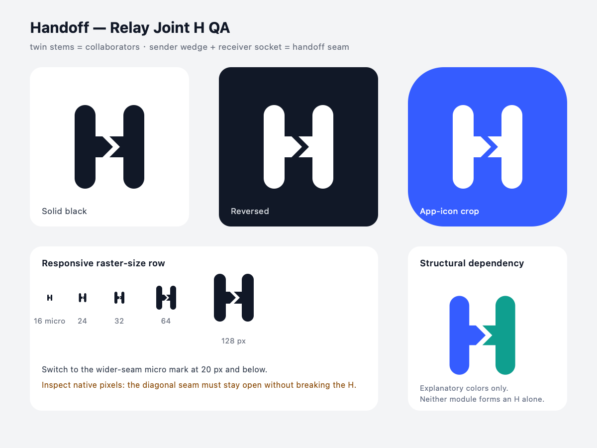

# Hero visual example — Handoff

> Fictional teaching case. The included artwork is original concept material, not a production identity, distinctiveness claim, or trademark clearance.

## Brief

Design a monochrome app icon for **Handoff**, a developer-handoff SaaS. Fuse an `H`, transfer, and collaboration into one mark that can survive at 16 px. Avoid people, handshakes, detached arrows, generic link icons, and a container that supplies the meaning.

Applicability: `proceed`. Two collaborators and a transfer action can plausibly share the `H` crossbar without damaging the letter skeleton.

## Concept families

Editable source: [handoff-concept-sheet.svg](../assets/examples/handoff/handoff-concept-sheet.svg)

The selected **Relay Joint H** uses two equal vertical stems as the collaborators. The left crossbar becomes a sender wedge; the right crossbar becomes a matching receiver socket. Their diagonal negative-space seam is the handoff. Removing either module destroys both the `H` and the transfer relationship.

The avoid map remains `not screened` at this early concept stage. The sheet does not claim originality or current-market distinctiveness.

## Rendered QA artifact

Editable sources: [handoff-mark.svg](../assets/examples/handoff/handoff-mark.svg), [handoff-micro-mark.svg](../assets/examples/handoff/handoff-micro-mark.svg), and [handoff-qa-board.svg](../assets/examples/handoff/handoff-qa-board.svg).

Observed in the included render:

- the main mark keeps one recognizable `H` silhouette in solid black, reverse, and an app-icon crop;
- the diagonal seam remains open at 24–128 px;
- a wider-seam responsive micro mark is used at 16 px;
- neither contributor module forms an `H` alone;
- the mark does not depend on color for its core reading.

Decision: `provisional pass for concept geometry`. Multi-renderer raster checks, five-second recognition testing, a current structural prior-art screen, native product-context testing, and trademark clearance remain pending.
