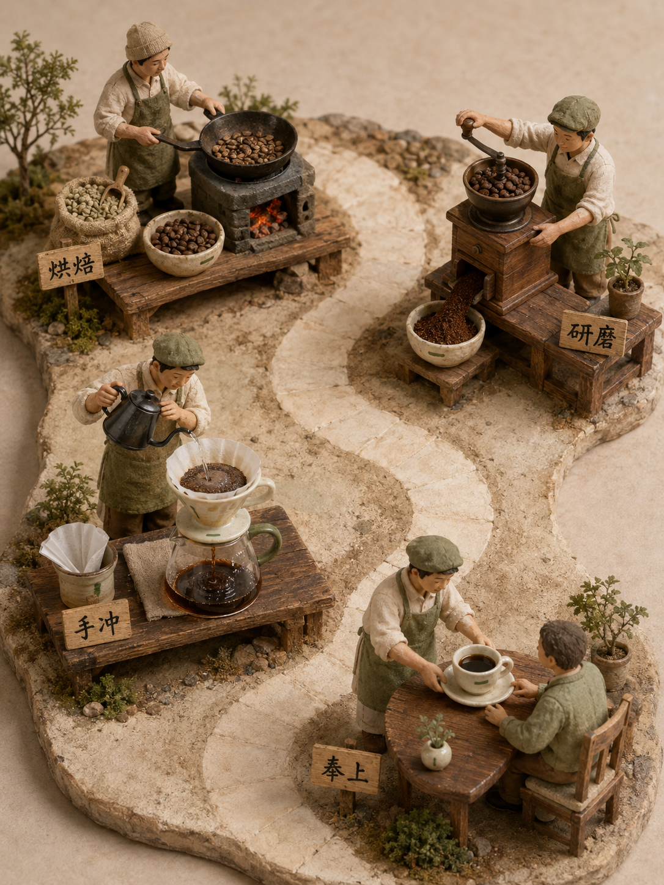
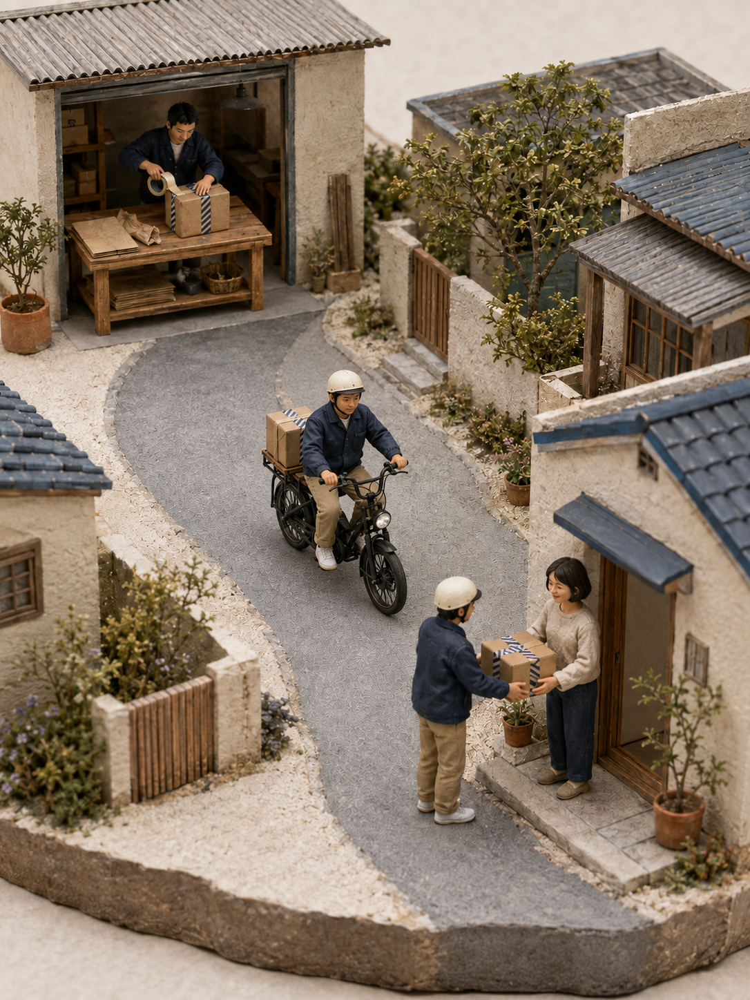

# 单路径流程微缩剧场

[简体中文](README.md) | [English](README.en.md)

**v0.1.1-rc.1 · 实验候选版。** 三题材图片沿用 v0.1.0 已审查成果；本版补充输入预检、能力说明与许可，不宣称图片质量已因此提升。候选分支可试用，不表示已合并主分支或稳定发布。

输入一个 3–5 步线性流程，得到一张完整的微缩世界：观看者沿着路、轨道或连续的操作空间，看到物体如何经过不同动作、变成最终产物。不是宫格漫画，也不是把普通流程图套上 3D 外观。

## 能做什么

- 把抽象的软件流程变成有载体身份的模型工坊。
- 把咖啡等真实制程中的材料变化画清楚。
- 用微缩街区讲述包裹等物体的交付旅程。
- 允许极少量中文环境标牌；需要纯净图时也可以不加字。
- 保留整体构图和跨区域的自然关系，不逐站生图再拼接。

## 三个已生成案例

### 代码上线：5 步

提交 → 自动测试 → 人工审核 → 构建打包 → 部署上线。


同一块红三角白色模块贯穿；构建后加透明外壳，部署时仍可看见内部模块。成品已补通审核台中央轨道。它是软件交付的物理隐喻，不是实际机械运行图。

### 咖啡制作：4 步

烘焙生豆 → 研磨熟豆 → 手冲萃取 → 奉上一杯咖啡。



生豆、熟豆、粉末、咖啡液分别可见，器具上下关系和出粉/注水方向经过检查。这是选定的简化主线，不表示完整咖啡工业制程。

### 包裹配送：3 步

仓库打包 → 配送途中 → 收件交付。



靛蓝斜纹胶带标识随纸箱贯穿。已修正首稿骑行反向问题；没有画出装卸、停车等宏观阶段之间的每个中间动作，胶带绕箱细节也不是像素级冻结。

## 怎么用

这个包不是独立绘图软件，也不包含模型权重或生图额度。实际需要能读取本地 Skill 的助手、图片生成工具、看图能力；验证脚本需要 Python 3.10+，无额外 Python 依赖。本轮只实测了内置 imagegen 的生成/编辑路径；其他模型未验证，也不要求 Midjourney 账号或专有风格码。具体说明见 [运行条件与本地试用](references/runtime.md)。

让具备图像生成能力、能读取 Skills 的助手加载本目录的 `SKILL.md`，然后给出：

- **流程：** 3–5 步，顺序明确；
- **画幅：** 默认 3:4，也可另行指定；
- **美术方向：** 例如暖色纸木工坊、精密工业或生活街区；
- **文字：** 无字，或少量中文环境路牌。

可直接使用：

> 用这个 Skill，把“选题 → 草稿 → 校对 → 发布”做成一张 3:4 的完整微缩编辑部。保持同一份稿件的身份，不要宫格，允许每站一块极短的中文路牌。

可以直接把目录交给助手，要求它读取 `SKILL.md` 后执行上面的任务；这不等于自动安装。

候选分支首次安装（目标同名目录应不存在；已有安装先备份）：

```sh
git clone --branch agent/add-process-diorama https://github.com/ZSeven-W/craft-skills.git craft-skills-diorama
mkdir -p "${CODEX_HOME:-$HOME/.codex}/skills"
cp -R craft-skills-diorama/skills/single-path-process-diorama "${CODEX_HOME:-$HOME/.codex}/skills/"
```

主分支合并后可使用默认分支。更换模型后应重新验证，本文不承诺所有环境自动可用。

超过五步或包含分支时，它会先处理范围：允许概括则保留映射、合并相邻步骤；要求完整逻辑则建议流程图或等待你选择拆分方式，不偷偷删步骤。

## 交付与质量门

每次默认保存 `final.png`、实际 `prompt.md`、短 `scene-contract.md` 和绑定最终图哈希的 `qa.md`。

审查两件不同的事：

1. **视觉完成度：** 整体感、材质、光线、空间层次、文字与裁切。
2. **流程忠实度：** 阶段数量和顺序、相邻动作、载体变化、路径与关键物理关系。

整页一次生成。默认一张主图、至多两次定向修订；如果关键错误仍未解决，明确报告，不用“验证通过”的标签掩盖。

## 文件验证器

Python 3.10+ 标准库即可，不需安装依赖：

```bash
python3 scripts/verify_delivery.py /path/to/outputs --ratio 3:4 --require-all-docs
python3 scripts/verify_delivery.py /path/to/outputs --ratio 3:4 --require-all-docs --review /path/to/review.json
```

独立审查 JSON 可包含：

```json
{"reviewed_image_sha256": "最终图片的64位SHA-256"}
```

默认只读，stdout 输出 JSON；`--manifest /path/to/report.json` 才写文件。`--require-all-docs` 强制成品四件套齐全；不加该参数时，契约和 QA 文档仅在存在时检查。PNG 块/扫描行完整性、精确画幅比例、文档非空与审查哈希绑定通过，**不代表视觉正确性通过**。脚本不会根据 QA 文案替人看图，也不把文案里出现一个哈希当成审图证明。

运行脚本测试：

```bash
python3 -B -m unittest discover -s tests -p 'test_verify_delivery.py' -v
```

本版 44 项单元测试通过。它们验证交付工具，不验证美术水平。

## 本轮对照结果

同任务、同评测内生成预算（1 次生成＋最多 1 次修订），有 Skill 与无领域 Skill 各做一张。无领域 Skill 基线仍可使用通用生图与设计工具指导。

| 案例 | 阶段数 | 匿名模型比较 |
|---|---:|---|
| 代码上线 | 5 | Skill 稿胜：顺序、连续路线和载体更清楚 |
| 咖啡制作 | 4 | 平局：Skill 稿动作清楚，基线构图也很出色 |
| 包裹配送 | 3 | Skill 稿小幅胜：封箱动作和缩略图节点更明确 |

语义检查为 21/21 对 20/21。每个题材只有一组样本，不能推成稳定成功率，也不是采用真人受试者的研究。代码评测中的一次修订网络失败，首次生成图用于对照；之后另做的生产修补单独保存，不回填评测成绩。

原始基线图片、提示词、失败日志和完整匿名评测页在本地研究工作区单独交付，不包含在这个可携带 Skill 包内。因此表格是本次研究摘要，不是可仅凭本包独立复核的认证；可用 evals/evals.json 的同一题目自行复测。

本版另外做了三类生成前边界测试，新旧版各一次；没有新增生图，也不将输入处理成绩当成画质提升。详细结果、评分歧义与限制见 [验证摘要](evals/VALIDATION.md)，版本变化见 [更新记录](CHANGELOG.md)。

## 不适用范围

- 精确分支、异常回路、时序同步、数值尺度；
- 可直接执行的机械结构图、工业操作规程；
- 保证无字画面唯一表达专业名词；
- 像素级产品身份或科学数据还原；
- 通用城市微缩图或电影场景。

## 素材与发布边界

本包三图是本轮内置生图工具生成的原创示意样张，不包含抓取图库、第三方专用风格码、私人角色或项目原始证据。使用前仍应按实际场景审查素材权利、隐私与模型条款。

沿用 craft-skills 集合的 Apache-2.0，见 [LICENSE](LICENSE)。代码、文档与原创示例范围见 [素材与许可说明](ASSET-LICENSE.md)，哈希见 [来源清单](evals/sample-origins.json)。不授权第三方商标、用户未来提交的参考素材，也不承诺生成图独占性。许可文件不代表已稳定发布。封面是独立概念图，不是第四个流程评测案例。
